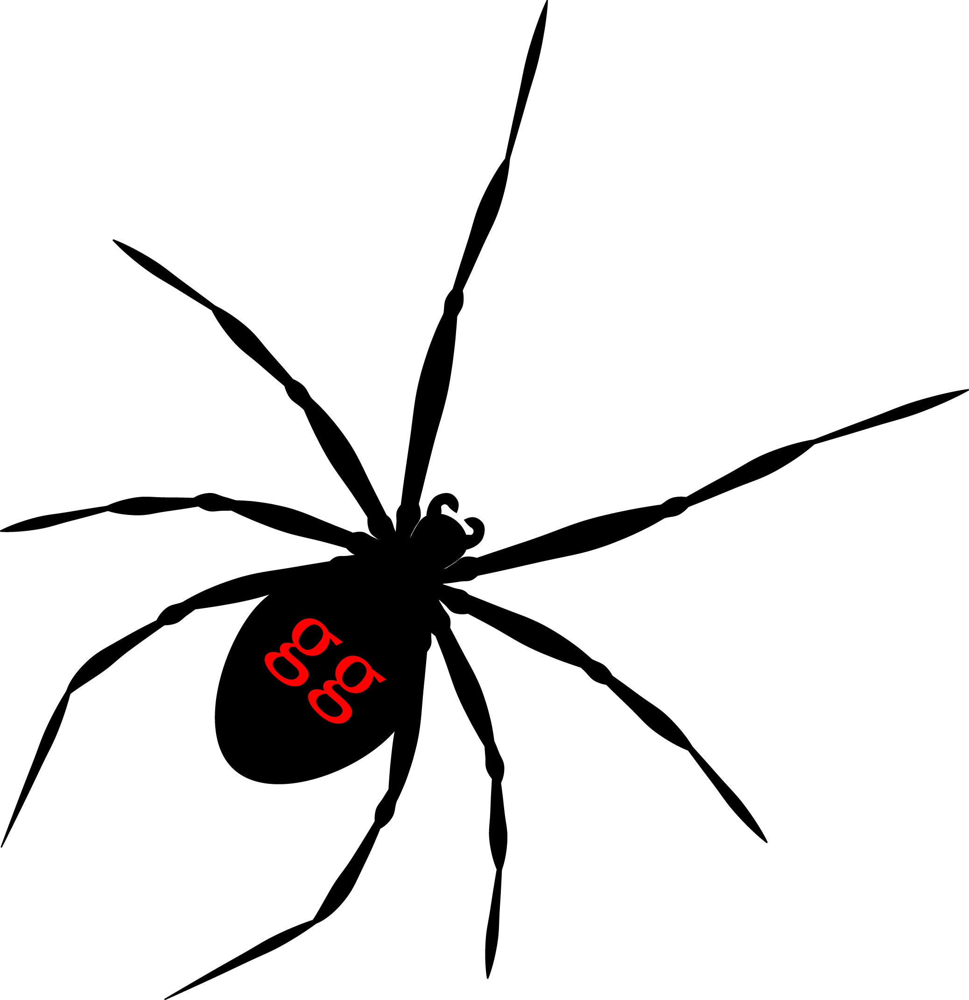

[](https://travis-ci.org/KlausVigo/tanggle)
[](https://codecov.io/gh/KlausVigo/tanggle)
[](https://coveralls.io/github/KlausVigo/tanggle?branch=master)


tanggle 
========================================================

tanggle provides function to plot phylogenetic networks of class `evonet` from *ape* and split graphs of class `networx` from *phangorn*.

You can install `remotes::install_github("KlausVigo/tanggle")`

To install *tanggle* you may need to install the *ggtree* package from bioconductor first:
```
if (!requireNamespace("BiocManager", quietly = TRUE))
    install.packages("BiocManager")

BiocManager::install("ggtree")
```

You also need to install *ggplot* and *phangorn*. If you are unsure if you have installed these packages, you can quickly run the code below:
```
packages_needed <- c("ggplot2", "phangorn")
 packages_to_install <- packages_needed[!(packages_needed %in% installed.packages()[,"Package"])]
 if(length(packages_to_install)) install.packages(packages_to_install)
```

If you use tanggle please cite:

Paradis E. & Schliep K. 2018. ape 5.0: an environment for modern phylogenetics 
and evolutionary analyses in R. Bioinformatics 35: 526-528.

Schliep K.P. 2011. phangorn: phylogenetic analysis in R. Bioinformatics, 27(4) 592-593

Schliep, K., Potts, A. J., Morrison, D. A. and Grimm, G. W. (2017), Intertwining phylogenetic trees and networks. Methods Ecol Evol. 8, 1212–1220.

and also 

Guangchuang Yu, David Smith, Huachen Zhu, Yi Guan, Tommy Tsan-Yuk Lam. ggtree: an R package for visualization and annotation of phylogenetic trees with their covariates and other associated data. Methods in Ecology and Evolution 2017, 8(1):28-36


License
-------
tanggle is licensed under the AGPL v3.


