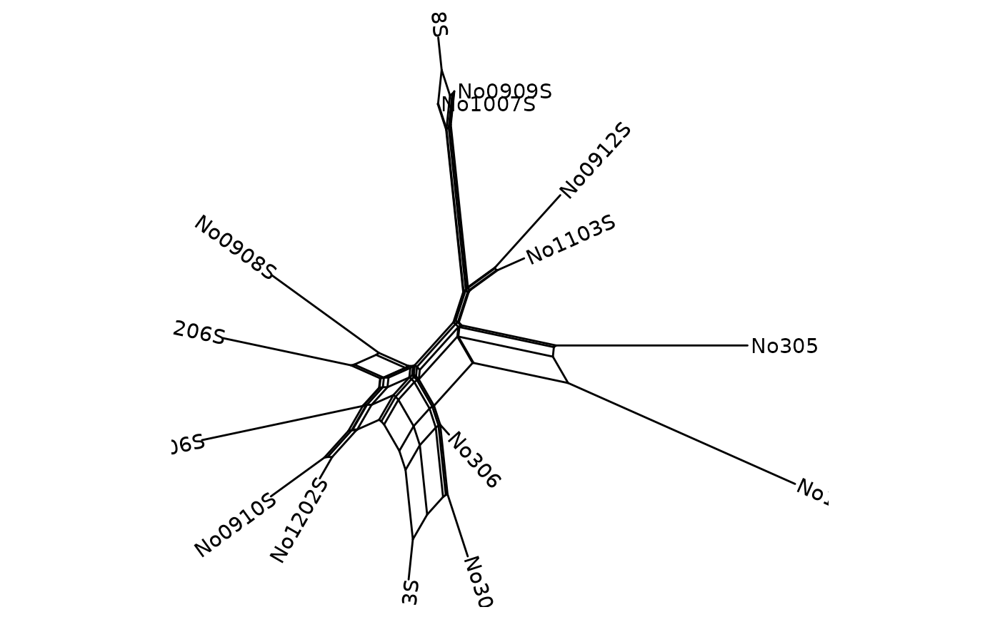
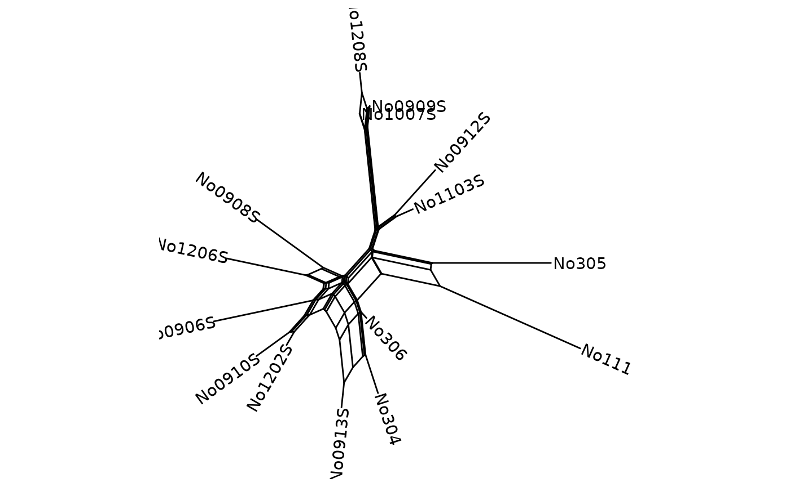
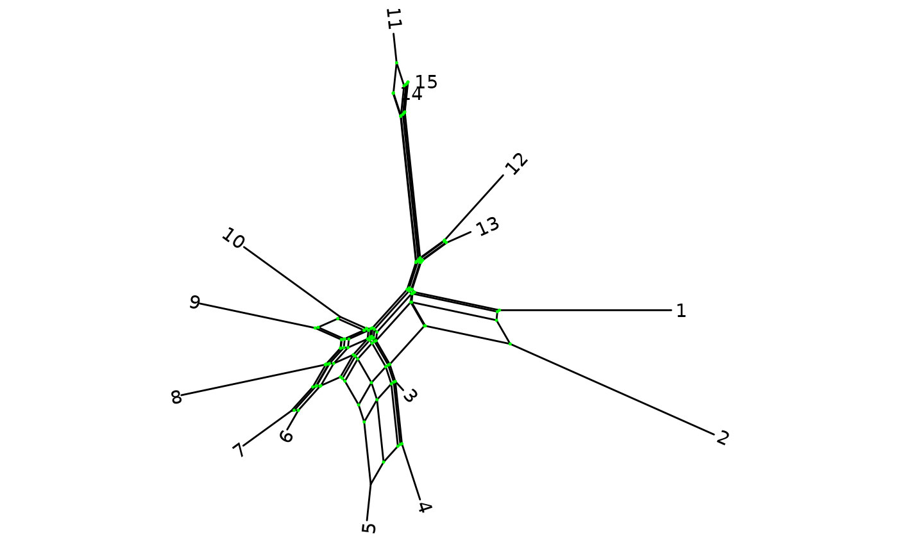
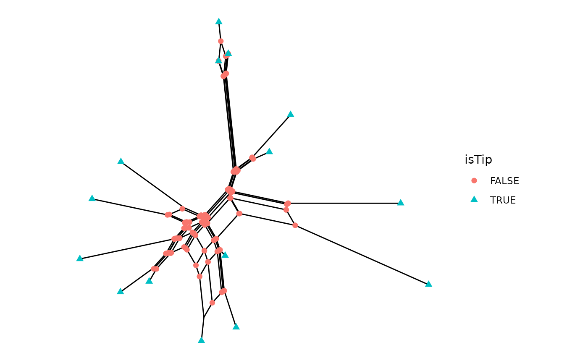
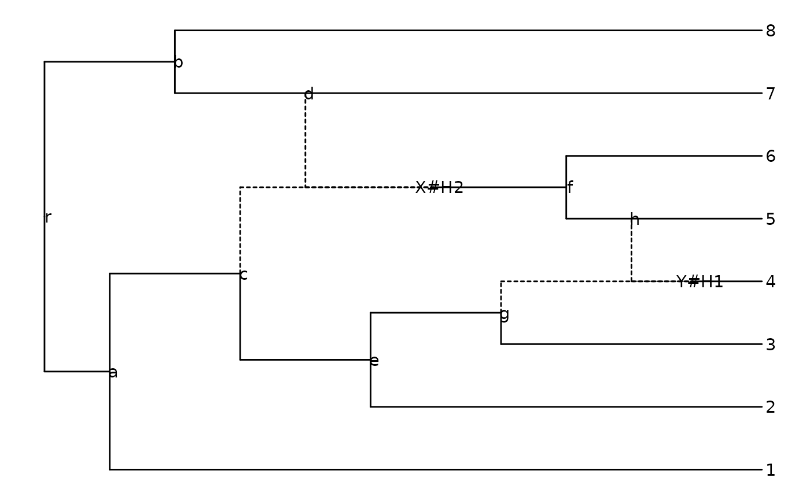
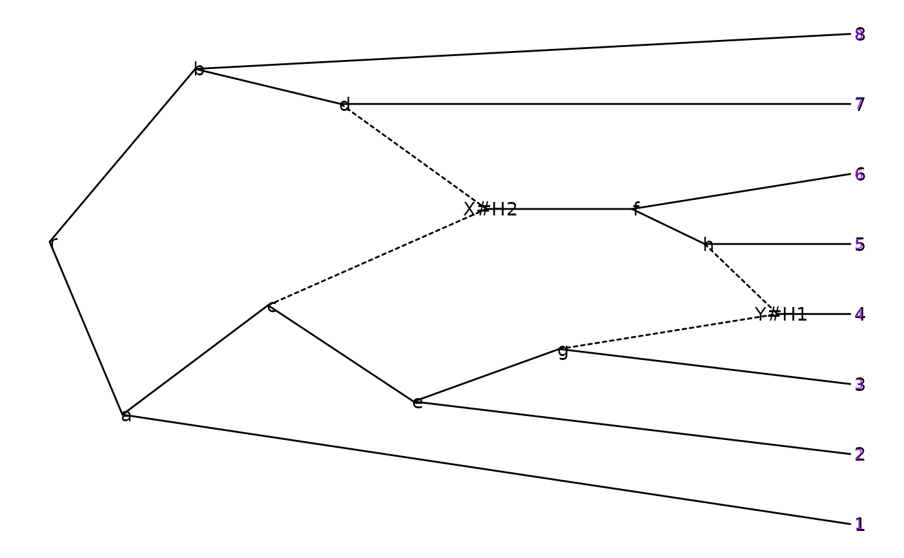
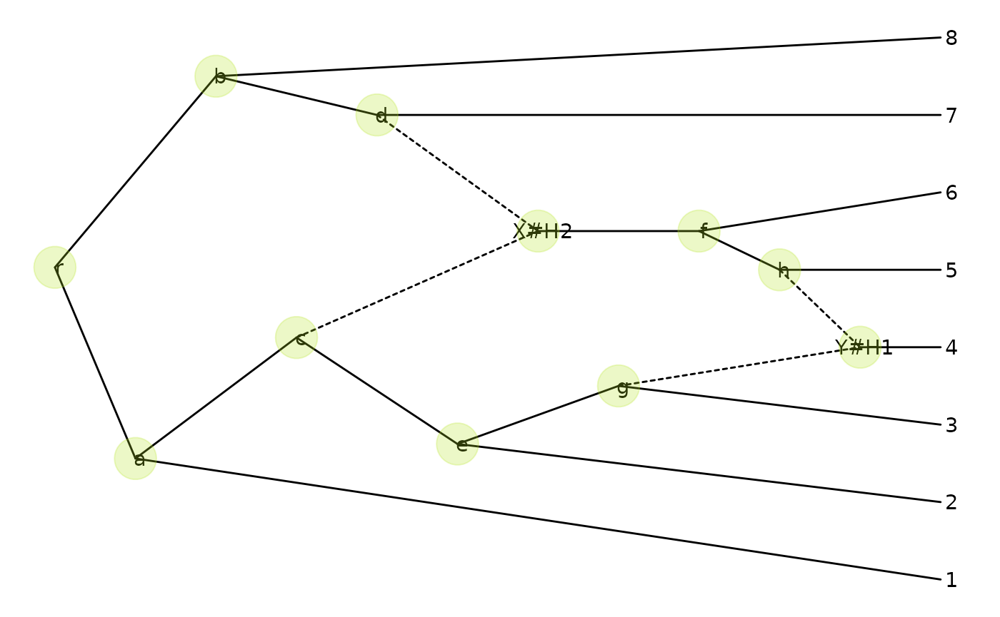

# \*\*\*tanggle\*\*\*: Visualización de redes filogenéticas con \*ggplot2\*

## Introducción

Esta es la viñeta en español para el paquete de R **tanggle**, en ella
proveemos una vista general de sus funciones y ejemplos de uso.
**Tanggle** extiende el paquete de R **ggtree** (Yu et al. 2017), lo
cual permite la visualización de múltiples tipos de redes filogenéticas
usando la sintaxis de *ggplot2* (Wickham 2016). Especificamente,
**tanggle** contiene funciones que permiten al usuario visualizar: (1)
redes divididas o implícitas (no-enraizadas, no-direccionadas) y (2)
redes explícitas (enraizadas, direccionadas) con reticulaciones. Estas
funciones ofrecen alternativas a las funciones gráficas disponibles en
*ape* (Paradis and Schliep 2018) y *phangorn* (Schliep 2011).

## Lista de funciones

| Function name | Brief description |
|:---|:---|
| `geom_splitnet` | Adds a *splitnet* layer to a ggplot, to combine visualising data and the network |
| `ggevonet` | Grafica una red explícita de un objeto *phylo* |
| `ggsplitnet` | Grafica una red implícita de un objeto *phylo* |
| `minimize_overlap` | Reduce el número de líneas de reticulación entrecruzadas en la gráfica |
| `node_depth_evonet` | Devuelve las profundidades o alturas de los nodos y puntas en la red filogenética |

## Para empezar

Instalar el paquete desde Bioconductor directamente:

Install the package from Bioconductor directly:

``` r

if (!requireNamespace("BiocManager", quietly = TRUE))
    install.packages("BiocManager")
BiocManager::install("tanggle")
```

O instalar la versión de desarrollo del paquete desde:
[Github](https://github.com/KlausVigo/tanggle).

``` r

if (!requireNamespace("remotes", quietly=TRUE))
    install.packages("remotes")
remotes::install_github("KlausVigo/tanggle")
```

Si necesita installer *ggtree* desde github:

``` r

remotes::install_github("YuLab-SMU/ggtree")
```

Y cargar todas las librerías:

``` r

library(tanggle)
library(phangorn)
library(ggtree)
```

------------------------------------------------------------------------

## Redes dividida o implicitas

Las redes divididas son objetos de visualización de datos que permiten
la definición de 2 (o más) opciones de división no compatibles. Las
redes divididas son usadas frecuentemente para graficar redes consenso
(Holland et al. 2004) o redes vecinas (Bryant and Moulton 2004). Esto
puede llevarse a cabo utilizando las funciones `consensusNet` o
`neighbor-net` en *phangorn* (Schliep 2011), o importando archivos Nexus
provenientes de SplitsTree (Huson and Bryant 2006).

## Tipos de datos

*tanggle* acepta tres formatos de entrada para redes divididas. Las
siguientes opciones de entrada generan un objeto *network* para
graficar.

- Archivo Nexus creado con SplitsTree (Huson and Bryant 2006) e
  importado con la función `read.nexus.network` en *phangorn* (Schliep
  2011).

- Carga de red dividida en formato Nexus:

``` r

fdir <- system.file("extdata/trees", package = "phangorn")
Nnet <- phangorn::read.nexus.networx(file.path(fdir,"woodmouse.nxs"))
```

2.  Una colección de árboles de genes (e.g., de RAxML (Stamatakis 2014))
    en alguno de los siguientes formatos: Importar archivo Nexus con la
    función `read.nexus` Archivo de texto en formato Newick (un árbol de
    genes por línea) importado con la función `read.tree`

Estimación de una red dividida consenso mediante la función
`consensusNet` en *phangorn* (Schliep 2011).

- Secuencias en Nexus, Fasta o formato Phylip importandas con la función
  `read.phyDat` en *phangorn* (Schliep 2011) o la función `read.dna` en
  *ape* (Paradis and Schliep 2018). Luego se calculan las matrices de
  distancia para los modelos de evolución específicos utilizando la
  función `dist.ml` en *phangorn* (Schliep 2011) o `dist.dna` en *ape*
  (Paradis and Schliep 2018). Con base en las matrices de distancia, se
  reconstruye una red dividida utilizando la función `neighborNet` en
  *phangorn* (Schliep 2011). ***Opcional***: las longitudes de las ramas
  pueden ser estimadas utilizando la función `splitsNetworks` en
  *phangorn* (Schliep 2011).

### Para graficar una Red Dividida

Podemos graficar una red con las siguientes opciones por defecto:

``` r

p <- ggsplitnet(Nnet) + geom_tiplab2()
p
```



Luego podemos establecer los límites para los ejes x & y permitiendo la
lectura de los nombres de los ejes.

``` r

p <- p + xlim(-0.019, .003) + ylim(-.01, .012) 
p
```



Es posible renombrar las puntas. Aquí cambiamos los nombres por un
consecutivo de 1 a 15:

``` r

Nnet$translate$label <- seq_along(Nnet$tip.label)
```

Podemos incluir los nombres de las puntas con `geom_tiplab2`, y con esto
personalizar algunas de sus opciones. Por ejemplo, las puntas de color
azul, en negrilla e itálicas; también los nodos internos en verde:

``` r

ggsplitnet(Nnet) + geom_tiplab2(col = "blue", font = 4, hjust = -0.15) + 
    geom_nodepoint(col = "green", size = 0.25)
```



Los nodos pueden ser anotados con `geom_point`.

``` r

ggsplitnet(Nnet) + geom_point(aes(shape = isTip, color = isTip), size = 2)
```



### Para graficar una Red Explícita

La función `ggevonet` dibuja redes explícitas (árboles filogenéticos
reticulados). Una adición reciente en *ape* (Paradis and Schliep 2018)
permite importar árboles en un formato Newick extendido (Cardona et al.
2008).

Importar una red explícita (ejemplo de Fig. 2 en Cardona et al. 2008):

``` r

z <- read.evonet(text = "((1,((2,(3,(4)Y#H1)g)e,(((Y#H1,5)h,6)f)X#H2)c)a,
                    ((X#H2,7)d,8)b)r;")
```

Para graficar una red explícita:

``` r

ggevonet(z, layout = "rectangular") + geom_tiplab() + geom_nodelab()
```



``` r

p <- ggevonet(z, layout = "slanted") + geom_tiplab() + geom_nodelab()
p + geom_tiplab(size=3, color="purple")
```



``` r

p + geom_nodepoint(color="#b5e521", alpha=1/4, size=10)
```



## Resumen

Esta viñeta ilustra todas las funciones en el paquete ***tanggle*** para
R. Aquí se proveen algunos ejemplos de como graficar redes implícitas y
explícitas. La visualización de redes divididas toma (se sirve de /
utiliza ???) la mayoría de las funciones compatibles con árboles no
enraizados en ggtree. Las opciones de diseño para las redes explícitas
son *rectangular* o *slanted*.

## Session info

``` r

sessionInfo()
#> R version 4.6.0 (2026-04-24)
#> Platform: x86_64-pc-linux-gnu
#> Running under: Ubuntu 24.04.4 LTS
#> 
#> Matrix products: default
#> BLAS:   /usr/lib/x86_64-linux-gnu/openblas-pthread/libblas.so.3 
#> LAPACK: /usr/lib/x86_64-linux-gnu/openblas-pthread/libopenblasp-r0.3.26.so;  LAPACK version 3.12.0
#> 
#> locale:
#>  [1] LC_CTYPE=C.UTF-8       LC_NUMERIC=C           LC_TIME=C.UTF-8       
#>  [4] LC_COLLATE=C.UTF-8     LC_MONETARY=C.UTF-8    LC_MESSAGES=C.UTF-8   
#>  [7] LC_PAPER=C.UTF-8       LC_NAME=C              LC_ADDRESS=C          
#> [10] LC_TELEPHONE=C         LC_MEASUREMENT=C.UTF-8 LC_IDENTIFICATION=C   
#> 
#> time zone: UTC
#> tzcode source: system (glibc)
#> 
#> attached base packages:
#> [1] stats     graphics  grDevices utils     datasets  methods   base     
#> 
#> other attached packages:
#> [1] phangorn_2.12.1  ape_5.8-1        tanggle_1.19.2   ggtree_4.2.0    
#> [5] ggplot2_4.0.3    BiocStyle_2.40.0
#> 
#> loaded via a namespace (and not attached):
#>  [1] fastmatch_1.1-8         gtable_0.3.6            xfun_0.58              
#>  [4] bslib_0.11.0            htmlwidgets_1.6.4       lattice_0.22-9         
#>  [7] quadprog_1.5-8          vctrs_0.7.3             tools_4.6.0            
#> [10] generics_0.1.4          yulab.utils_0.2.4       parallel_4.6.0         
#> [13] tibble_3.3.1            pkgconfig_2.0.3         Matrix_1.7-5           
#> [16] ggplotify_0.1.3         RColorBrewer_1.1-3      S7_0.2.2               
#> [19] desc_1.4.3              lifecycle_1.0.5         compiler_4.6.0         
#> [22] farver_2.1.2            treeio_1.36.1           textshaping_1.0.5      
#> [25] codetools_0.2-20        ggfun_0.2.0             fontquiver_0.2.1       
#> [28] fontLiberation_0.1.0    htmltools_0.5.9         sass_0.4.10            
#> [31] yaml_2.3.12             lazyeval_0.2.3          pillar_1.11.1          
#> [34] pkgdown_2.2.0           jquerylib_0.1.4         tidyr_1.3.2            
#> [37] MASS_7.3-65             cachem_1.1.0            nlme_3.1-169           
#> [40] fontBitstreamVera_0.1.1 tidyselect_1.2.1        aplot_0.2.9            
#> [43] digest_0.6.39           dplyr_1.2.1             purrr_1.2.2            
#> [46] bookdown_0.46           labeling_0.4.3          fastmap_1.2.0          
#> [49] grid_4.6.0              cli_3.6.6               magrittr_2.0.5         
#> [52] patchwork_1.3.2         withr_3.0.2             gdtools_0.5.1          
#> [55] scales_1.4.0            rappdirs_0.3.4          rmarkdown_2.31         
#> [58] igraph_2.3.2            otel_0.2.0              ragg_1.5.2             
#> [61] evaluate_1.0.5          knitr_1.51              gridGraphics_0.5-1     
#> [64] rlang_1.2.0             ggiraph_0.9.6           Rcpp_1.1.1-1.1         
#> [67] glue_1.8.1              tidytree_0.4.7          BiocManager_1.30.27    
#> [70] jsonlite_2.0.0          R6_2.6.1                systemfonts_1.3.2      
#> [73] fs_2.1.0
```

## References

Bryant, David, and Vincent Moulton. 2004. “Neighbor-Net: An
Agglomerative Method for the Construction of Phylogenetic Networks.”
*Molecular Biology and Evolution* 21 (2): 255–65.
<https://doi.org/10.1093/molbev/msh018>.

Cardona, Gabriel, Francesc Rosselló, and Gabriel Valiente. 2008.
“Extended Newick: It Is Time for a Standard Representation of
Phylogenetic Networks.” *BMC Bioinformatics* 9 (1): 532.
<https://doi.org/10.1186/1471-2105-9-532>.

Holland, Barbara R., Katharina T. Huber, Vincent Moulton, and Peter J.
Lockhart. 2004. “Using Consensus Networks to Visualize Contradictory
Evidence for Species Phylogeny.” *Molecular Biology and Evolution* 21
(7): 1459–61. <https://doi.org/10.1093/molbev/msh145>.

Huson, D. H., and D. Bryant. 2006. “Application of Phylogenetic Networks
in Evolutionary Studies.” *Molecular Biology and Evolution* 23 (2):
254–67.

Paradis, Emmanuel, and Klaus Schliep. 2018. “Ape 5.0: An Environment for
Modern Phylogenetics and Evolutionary Analyses in r.” *Bioinformatics*
35 (3): 526–28.

Schliep, Klaus Peter. 2011. “Phangorn: Phylogenetic Analysis in R.”
*Bioinformatics* 27 (4): 592–93.
<https://doi.org/10.1093/bioinformatics/btq706>.

Stamatakis, A. 2014. “RAxML Version 8: A Tool for Phylogenetic Analysis
and Post-Analysis of Large Phylogenies.” *Bioinformatics* 30 (9):
1312–13.

Wickham, Hadley. 2016. *Ggplot2: Elegant Graphics for Data Analysis*.
Springer-Verlag New York. <https://ggplot2.tidyverse.org>.

Yu, Guangchuang, David Smith, Huachen Zhu, Yi Guan, and Tommy Tsan-Yuk
Lam. 2017. “Ggtree: An r Package for Visualization and Annotation of
Phylogenetic Trees with Their Covariates and Other Associated Data.”
*Methods in Ecology and Evolution* 8: 28–36.
<https://doi.org/10.1111/2041-210X.12628>.
